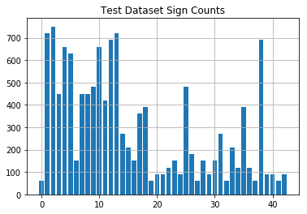

# CarND - Traffic Sign Classifier - Project 3
Udacity Self-Driving Car Engineer Nanodegree Program <br>[](http://www.udacity.com/drive)
<br>
<p align="center">

</p>

# Overview

The goals / steps of this project are the following:

- Loadthe data set
- Explore, summarize and visualize the data set
- Design, train and test a model architecture
- Use the model to make predictions on new images
- Analyze the softmax probabilities of the new images
- Summarize the results with a written report

My code for this project is publicly available and can be found here:<br>https://github.com/ednaldogoncalves/CarND-TrafficSignClassifier-P3


### Dependencies
This lab requires:

* [CarND Term1 Starter Kit](https://github.com/udacity/CarND-Term1-Starter-Kit)

The lab environment can be created with CarND Term1 Starter Kit. Click [here](https://github.com/udacity/CarND-Term1-Starter-Kit/blob/master/README.md) for the details.

### Dataset and Repository

1. Download the data set. The classroom has a link to the data set in the "Project Instructions" content. This is a pickled dataset in which we've already resized the images to 32x32. It contains a training, validation and test set.
2. Clone the project, which contains the Ipython notebook and the writeup template.
```sh
git clone https://github.com/udacity/CarND-Traffic-Sign-Classifier-Project
cd CarND-Traffic-Sign-Classifier-Project
jupyter notebook Traffic_Sign_Classifier.ipynb
```

## Data Set Summary & Exploration

### Basic Summary of the Data Set

I used the numpy library to calculate summary statistics of the traffic signs data set:

- The size of training set is 34799
- The size of test set is 12630
- The shape of a traffic sign image is (32, 32, 3)
- The number of unique classes/labels in the data set is 43

### Exploratory visualization of the dataset

Here is an exploratory visualization of the data set. It pulls in a random set of eight images and labels them with the correct names in reference with the csv file to their respective id's.<br>
<p align="center">

</p>

It looks like a fair data set. Some of the images look crisp and clear, while other images look somewhat distorted. Some are blured, some are too dark, some were taken from an angle. However, since we will be implementing a convolutional neural network, these issues will be minimized during training.

### Image Class Distributions

Let's look into how many samples each class has<br>
<p align="center">

</p>
<p align="center">

</p>
<p align="center">

</p>

We can see how some of the traffic signs are under-represented. Some classes have a factor of 100 samples as many samples as other classes. This couple present a problem in which classes that have fewer samples have a lower chance of accurately generalizing on the testing data.

It look like the samples were split into train/test uniformly randomly as we can see a very similar trend on the test and train sets.

## Design and Test a Model Architecture

### Pre-processing the Data Set

I converted the images to grayscale because in the technical paper it outlined several steps they used to achieve 93%. I assume this works better because the excess information only adds extra confusion into the learning process. After the grayscale I also normalized the image data because I've read it helps in speed of training and performance because of things like resources. Also added additional images to the datasets through randomized modifications.
Here is an example of a traffic sign images that were randomly selected.<br>
<p align="center">

</p>

Here is a look at the normalized images. Which should look identical, but for some small random alterations such as opencv affine and rotation.<br>
<p align="center">

</p>

I increased the train dataset size to 89860 and also merged and then remade another validation dataset. Now no image class in the train set has less then 1000 images.<br>
<p align="center">

</p>

Test set was left alone.<br>
<p align="center">

</p>

Validation set gained 20% of the original total mentioned above. I did this using scikit learns train test split method.<br>
<p align="center">

</p>

### Modelarchitecture

My final model consisted of the following layers:<br>

Layer							|               Description
:-----------------------: | :---------------------------------------------------------:
Input							| 	32x32x1 grayscaleimage
Convolution 5x5 		| 	2x2 stride, valid padding, outputs 28x28x6
RELU							|
Max pooling					|	2x2 stride, outputs 14x14x6
Convolution 5x5			| 2x2 stride, valid padding, outputs 10x10x16
RELU							|
Max pooling					|	2x2 stride, outputs 5x5x16
Convolution 1x1			|	2x2 stride, valid padding, outputs 1x1x412
RELU							|
Fullyconnected			|	input 412, output 122
RELU							|
Dropout						|	50% keep
Fullyconnected				|	input 122, output 84
RELU							|
Dropout							|	50% keep
Fullyconnected				|	input 84, output 43


### Model Training


To train the model, I used an LeNet for the most part that was given, but I did add an additional convolution without a max pooling layer after. I used a learning rate of 0.00089. The epochs used was 35 while the batch size was 156. Other important parameters I learned were important was the number and distribution of additional data generated. I played around with various different distributions of image class counts and it had a dramatic effect on the training set accuracy. It didn't really have much of an effect on the test set accuracy, or real world image accuracy. Just using the default settings from the lesson leading up to this point I was able to get around 94% accuracy.

### Solution Approach

My final model results were:
- Training set accuracy of 100.0%
- Validation set accuracy of 94.1%
- Test set accuracy of 93.5%

The first model is adapted from LeNet architecture. Since LeNet architecture has a great performance on recognizing handwritings, I think it would also work on classifying traffic signs.

I used the same parameter given in LeNet lab. Its training accuracy initially was around 90%, so I thought the filter depth was not large enough to capture images' shapes and contents. Previously the filter depth was low for the first and second layer. I increased them and accuracy increased to around 94%.

I also tuned epoch, batch_size, and rate parameters, and settled at:
- epoch 35
- batch_size 156
- learning rate 0.00089

I have my explainations of the effect of the drop out layer after I've seen some of the training data. Some images are too dark to see the sign, so it seems that these images act as noises in the training data and drop out layer can reduce the negative effects on learning.

The final accuracy in validation set is around 0.941.<br>
<p align="center">

</p>
<p align="center">

</p>

## Test a Model on New Images

### New Images

Here are five German traffic signs that I found on the web:<br>


<br>I used semi-easy images to classify and even modified them slightly. I made them all uniform in size and only had one partially cut off.

### Performance on New Images

The accuracy on the new traffic signs is 66.7%, while it was 94% on the test set. This is a sign of underfitting. By looking at the virtualized result, I think this can be addressed by using more image preprocessing techniques on the training set.

By looking at the virtualized data. The prediction accuracy was 83,3%. I think to get the consistent correctness, I need more good data. One simple thing to do might be to preprocess the image by brightening dark ones.

The model's predictions on these new traffic signs were spot on. Below are theresults-<br>

Image					|		Prediction
:-------------------: | :----------------:
AheadOnly			|	AheadOnly
BicycleOnly			|	BicycleOnly
No Entry			|	No Entry
Pedestrian			|	Pedestrian
Wild Animal Crossing	|	Wild Animal Crossing

The model was able to correctly guess 5 of the 5 traffic signs, which gives an accuracy of 100%. This compares favorably to the accuracy on the test set of 95%

Calculating the accuracy for these new images. The model predicted 3 out of 6 signs correctly, it's 50% accurate on these new images.


### Model Certainty - Softmax Probabilities

This is the softmax probabilities for the predictions on the German traffic sign images found on the web:<br>
<p align="center">

</p>
<p align="center">

</p>
<p align="center">

</p>
<p align="center">

</p>
<p align="center">

</p>
<p align="center">

</p>
The model was able to correctly guess 4 of the 6 traffic signs, which gives an accuracy of 67%. This compares favorably to the accuracy on the test set although I did throw it a softball.

